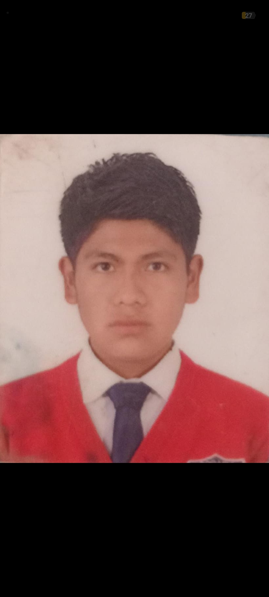

<html lang="es">
<head>
<meta charset="UTF-8">
<meta name="viewport" content="width=device-width, initial-scale=1.0">
<title>Currículum | José Miguel</title>

</head>

<body>

    <!-- ENCABEZADO -->
    

        
        <h1>José Miguel Romero Ávila</h1>
        <h3>CEO / Director · Ciber Human</h3>
        <button onclick="window.print()">Imprimir CV</button>
    

    <!-- CONTENIDO -->
    

        <!-- COLUMNA IZQUIERDA -->
        <aside class="sidebar">

            

                <h2>¿Quién soy?</h2>
                

                    Soy CEO y Director de la empresa Ciber Human. Me encargo de tomar decisiones estratégicas,
                    definir la dirección de la empresa, supervisar áreas, administrar recursos y representar
                    a la empresa ante socios e inversionistas.
                

            

            

                <h2>Información Personal</h2>
                <ul class="info">
                    <li><strong>Fecha:</strong> 02/02/2007</li>
                    <li><strong>Email:</strong> josemiguelromeroavila@gmail.com</li>
                    <li><strong>Teléfono:</strong> 729 550 4363</li>
                    <li><strong>Instagram:</strong> _.j.miguel17</li>
                    <li><strong>Dirección:</strong> Otzolotepec, Estado de México</li>
                </ul>
            

        </aside>

        <!-- COLUMNA DERECHA -->
        <main class="main">

            

                <h2>Experiencia Profesional</h2>

                

                    <h4>Motriz – Especialista en Ciberseguridad</h4>
                    2016 – 2019
                    

                        Empresa dedicada a cursos de ciberseguridad y programación.
                        Aportación: Aprendió procesos técnicos, adaptación a clientes
                        y trato con estudiantes.
                    

                

                

                    <h4>OrtoFlex Solutions – Coordinador de Taller</h4>
                    2019 – 2022
                    

                        Taller especializado en dispositivos digitales.
                        Aportación: Supervisó producción, optimizó tiempos
                        y lideró un equipo multidisciplinario.
                    

                

                

                    <h4>Advance Rehab Group – Gerente de Operaciones</h4>
                    2022 – 2024
                    

                        Cadena de servicios y atención de cursos.
                        Aportación: Expansión de la empresa, implementación
                        de estrategias de servicio y mejora en atención al cliente.
                    

                

            

        </main>

    

</body>
</html>
